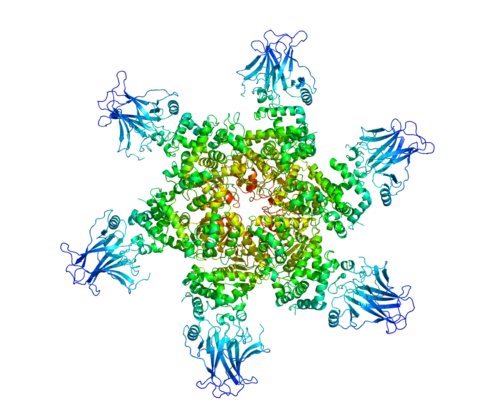

# molcv

This repository contains a Python package and a Rust crate for calculating the circular variance of protein residues.

The following is an example output for the [2H1L sturcture](https://www.rcsb.org/structure/2h1l), where red corresponds to a circular variance of 1 and dark blue to 0.

<div style="display: flex; justify-content: center;">
  
</div>

The Rust crate uses [WebGPU](https://github.com/gfx-rs/wgpu) to perform calculations on the GPU while providing support for all major platforms. The Python package contains bindings to the Rust crate.


## Usage

### Installation

```sh
$ cargo add molcv
# Or
$ pip install molcv
```

### Usage

```sh
# CLI
$ molcv input.pdb --pdb-output-path output.pdb --cutoff 100
$ molcv input.pdb --npy-output-path output.npy --cutoff 50 --cutoff 100
```
